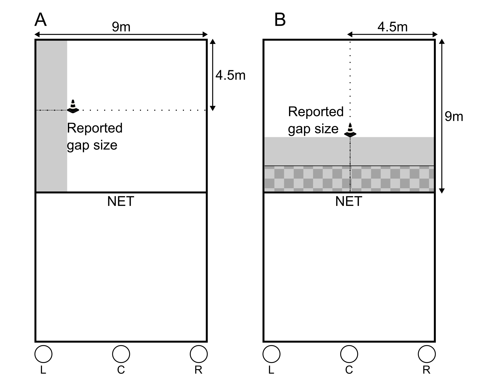

# Research Overview

The full article can be found HERE (to be added).

In volleyball, players adjust their serves according to game situations, such as scoring points by hitting the ball towards an open area. Previous research has documented refined perception of affordances for kicking a soccer ball through narrow gaps. We asked whether volleyball players could perceive affordances for serving the ball into narrow gaps. Eleven volleyball players with more experience(mean = 4.6 years) and thirteen players with less competitive playing experience (mean = 2.1 years) participated in this study. Using the method of adjustment, participants adjusted markers on the court to create the minimum gap into which they could serve the ball. They separately created gaps for short serves (i.e., servers close to the net), and sideline serves. We predicted that gaps would be smaller for sideline serves than for short serves. Later, we assessed their actual ability to serve the ball into their self-created gaps. Consistent with our prediction, gaps for sideline serves (M = 1.93 m, SD = 0.71 m) were smaller than for short serves (M = 3.66 m, SD = 0.67 m). The mean proportion of successful serves for the More Experienced group (36% ± 31%) was greater than for the Less Experienced group (26% ± 25%), confirming that experience was associated with greater serving skill. The interaction between experience groups and serve types was significant, revealing that the effect of experience on actual serving performance was greater for sideline serves than for short serves. Our results confirm that competitive volleyball players accurately differentiated affordances for short versus sideline serves. Our results suggest that 2 years of competitive experience was sufficient for players to acquire refined perception of affordances for serving.

# Methods

The experiment was conducted on a standard volleyball court. Among the teams involved in our study, the height of the net differed, such that some participants were used to playing with different net heights. Accordingly, in our study net height was adjusted to be at the typical height for each participant. For this reason, four participants were tested at a net height of 2.15 m, while the remaining participants were tested at a net height of 2.24 m. We placed on the floor two 9-meter tape measures (Figure 1), one 4.5 m parallel to and 4.5 m from the net and another perpendicular to the net and 4.5 m away from each sideline. A pyramidal "traffic" cone (45 cm in height) was used to define gaps relative to the net and sidelines.

{width="455"}

Figure 1.  Conditions used in the experiment. The experimenter moved the cone along the dotted line (a tape measure on the floor) until instructed by the participant to stop, determining the gap (indicated by shaded area). The shaded rectangle represents the total area of the gap. The participant stood in one of three locations on the back line (indicated by the circles labeled L, C, and R). A. Sideline serve condition. B. Short serve condition. The checkered area represents that portion of the reported gap into which participants typically would not serve the ball in a game (see text for details).

After a brief explanation of the testing procedures, the participant warmed up for 5 to 10 minutes as they usually would for practice, performing dynamic stretches and serves on the court. The experimental testing comprised two parts---first, perceptual reports and then performance (Peker, Böge et al., 2020).

*Perceptual reports*. The two perceptual report conditions are illustrated in Figure 1. In the Sideline Serve Condition (Figure 1A), participants were asked to report the narrowest gap, relative to either the left or right sideline and extending from the net to the back line, into which they could serve the ball. In the Short Serve Condition (Figure 1B), participants were asked to report the narrowest gap, relative to the net and extending from sideline to sideline, in to which they could serve the ball. Perceptual reports were made using the method of adjustment. Before making perceptual reports, participants were asked stand on the back line in the location from which they would typically serve during a game (e.g., right, middle, or left side). For the Sideline condition, the participant chose the sideline to which they would serve; left or right. and the type of serve they typically would employ---either float, or jump float.  

To make perceptual reports, participants stood on the end line in their chosen location (right, middle, or left) and instructed the Experimenter (standing on the opposite side of the net) to move a traffic cone until it marked the outer edge of a gap defined relative to the sideline or the net. In the Sideline Serve condition, half of the trials began with the cone at one sideline, and half of the trials began with the cone at the other sideline. In the Short Serve condition, half of the trials began with the cone at the net, and half of the trials began with the cone at the back line. These manipulation were such that, for each participant, we alternated trials on which gaps increased or decreased in width. After each perceptual report, the participant turned their back while the experimenter repositioned the cone for the next trial. The order of conditions was counterbalanced across participants. Participants gave six perceptual reports for each condition, for a total of 12 perceptual reports.

*Performance.* After the perceptual reports for both conditions, the participants attempted to serve into the mean reported gap width in that condition. Separately for short serves and sideline serves, participants were required to stand in the same position along the back line from which they had made their perceptual reports. Then, the participant warmed up by performing five serves. Next, we positioned the cone on the average distance obtained from the participant's perceptual reports, and the participant attempted to serve into the gap beween the cone and the relevant boundary (depending on condition). The order of the sideline and short serving conditions was counterbalanced across participants.

Participants did not perform a predetermined number of serves. Rather, the participant continued to serve until they had completed three valid serves, where a valid serve was one that passed over the net and landed anywhere in-bounds, either within or outside the participant's chosen gap. An experimenter recorded whether each valid serve landed within or outside of the gap. For each condition, the participant was required to stand in the same location from which they had made their perceptual reports. When a serve outcome was uncertain (e.g., whether the ball landed in or out of bounds), we asked the participant to repeat the serve. Final determinations were made later, from the video recordings.

# Data Analysis

```{r,warning=FALSE}
#Loading the required package to import the dataset

library("readxl") #Loading this package
library("psych")
library("ez") #loading the needed packages
library("apa") #loading the needed packages
library("dplyr") #loading the needed packages
library("tidyr")
library("lme4")
library("ggplot2") 

#Importing dataset
data = read_excel("arrudetal_2023_dataset.xlsx")

#Assigning IV: ID, Level, Order, Condition
data$part_id <-factor(data$part_id)
data$level <-factor(data$level,c('1', '2'), labels=c("Less Experienced", "More Experienced"))
data$order <-factor(data$order)
data$condition <-factor(data$condition,c('1','2'), labels=c("Sideline","Short"))
```

## **Descriptive Analysis**

### **Less Experienced**

```{r,warning=FALSE}
describe(data[data$level == 'Less Experienced',])
```

### **More Experienced**

```{r,warning=FALSE}
describe(data[data$level == 'More Experienced',])
```

## Reported Gap Size

```{r,warning=FALSE}

#Running anova model including order as control variable
#Order was not significant so it can be removed from the model
anova_jud_with_order <- ezANOVA(data = data, dv = gap_size, wid = part_id,
                     within = condition, between = c(level, order),
                     type = 3, return_aov = TRUE, detailed = TRUE)
cat("The factor 'order' was not significant (", anova_jud_with_order$ANOVA$p[3], "). So it was removed from the model\n", sep = "")


#Running the model without order
anova_jud<-ezANOVA(data=data,dv= gap_size, wid= part_id,within= condition,
                 between= level,type=3,return_aov=TRUE,detailed = TRUE)
anova_apa(anova_jud,es=c("pes"))
```

**Figure 2. Mean perceived minimum serve-able gap size**

```{r,warning=FALSE}
#Adding a function to calculate standard error
se <- function(x) sd(x)/sqrt(length(x)) 

(plot_quest <- data %>% 
    mutate(
      Condition = condition %>% as.factor,Level = level %>% as.factor) %>% 
    group_by(Condition,Level) %>% 
    summarise(mean_perf = mean(gap_size, na.rm = TRUE),se_perf=se(gap_size)
    ) %>% 
    drop_na())

pd=position_dodge(0.3)

plot_quest %>% 
  
  ggplot(aes(Condition,mean_perf, group=Level,fill=Level)) +
  geom_bar(stat="identity", color="black", 
           position=position_dodge())  +scale_y_continuous(expand = expansion(mult = c(0,0.2)),
                                                           breaks=(c(0,.5,1,1.5,2,2.5,3,3.5,4,4.5)))+
  geom_errorbar(aes(ymin=mean_perf-se_perf, ymax=mean_perf+se_perf), width=.2,
                position=position_dodge(.9)) + ylab(label=c("Mean Gap Size (m)"))+
  theme_light(base_size=16)+ theme(legend.title=element_blank(),panel.border = element_blank(),
                                   panel.grid.major.x = element_blank(),panel.grid.minor.y = element_blank(),
                                   axis.title.x = element_blank())+
  scale_fill_grey( start = 0.4,end = 0.8,aesthetics = "fill")+
  theme(axis.line = element_line(colour = "black")) +geom_hline(yintercept = 0) +
  labs(caption = "Figure 2. Mean perceived minimum serve-able gap size \n as a function of serve type (Short vs. Sideline), \nand experience groups (Less vs. More). \n The error bars represent the standard error of the mean. ")
```

## **Performance Analysis**

```{r,warning=FALSE}
quasi_model=glm(proportion_of_successfull ~ level*condition +(1/part_id),
                 data=data,family = "quasibinomial")
summary(quasi_model) 

```

**Plotting performance**

```{r,warning=FALSE}
(plot_perf <- data %>% 
      mutate(
        Condition = condition %>% as.factor,Level = level %>% as.factor) %>% 
      group_by(Level, Condition) %>% 
      summarise(mean_perf = mean(proportion_of_successfull, na.rm = TRUE),se_perf=se(proportion_of_successfull)
      ) %>% 
      drop_na())
  comparisons=c
  
  
  pd=position_dodge(0.3)
  
  plot_perf %>% 
    
    ggplot(aes(Condition,mean_perf, group=Level,fill=Level)) +
    geom_bar(stat="identity", color="black", 
             position=position_dodge())  +scale_y_continuous(expand = expansion(mult = c(0, 0.2)),
                                                             breaks=(c(0,0.1,.2,.3,.4,.5,.6,.7,0.8)))+
    geom_errorbar(aes(ymin=mean_perf-se_perf, ymax=mean_perf+se_perf), width=.2,
                  position=position_dodge(.9)) + ylab(label=c("Proportion of Successfull Serves"))+
    theme_light(base_size=16)+ theme(legend.title=element_blank(),panel.border = element_blank(),
                                     panel.grid.major.x = element_blank(),panel.grid.minor.y = element_blank())+
    scale_fill_grey( start = 0.4,end = 0.8,aesthetics = "fill",labels = c("Less Experienced", "More Experienced"))+
    theme(axis.line = element_line(colour = "black"),axis.title.x = element_blank())+
    geom_hline(yintercept = 0)+
  labs(caption = "Figure 3. The proportion of successful serves \n(out of the number of attempts required to complete 3 valid serves) \nas a function of serve type (Short vs. Sideline) \nand experience groups (Less vs. More). \nThe error bars represent the standard error of the mean.")
  
```

### Post-hoc analysis

```{r,warning=FALSE}
#Subsetting into success and failure
success_fail=cbind(data$amount_in_gap,data$amount_of_serves)
success=data$amount_in_gap
fails=data$amount_of_serves-data$amount_in_gap

data$success_count=success
data$fails_count=fails

#Making contingency table
data_chi <- data %>%  #using pipe function to determine the factors
    group_by(level,condition) %>% 
    summarise(total_in = sum(success_count),total_out=sum(fails_count)
    ) %>% 
    drop_na()

#sideline more experienced vs. less experienced
table=data_chi[1,3:4]
table[2,]=data_chi[3,3:4]
chisq=chisq.test(table)
# Print the results
cat("More vs. Less Experienced for Sideline Serves \nChi-square statistic: ", chisq$statistic," \np-value:",chisq$p.value,sep="")


#short more experienced vs. less experienced
table=data_chi[2,3:4]
table[2,]=data_chi[4,3:4]
chisq=chisq.test(table)
cat("More vs. Less Experienced for Short Serves \nChi-square statistic: ", chisq$statistic," \np-value:",chisq$p.value,sep="")


#less experienced short vs. sideline
table=data_chi[1,3:4]
table[2,]=data_chi[2,3:4]
mcnem_test=mcnemar.test(as.matrix(table))
# Print the results
cat("Short vs. Sideline Serves for Less Experienced \nChi-square statistic: ", mcnem_test$statistic," \np-value:",mcnem_test$p.value,sep="")


#more experienced short vs. sideline
table=data_chi[3,3:4]
table[2,]=data_chi[4,3:4]
mcnem_test=mcnemar.test(as.matrix(table))
cat("Short vs. Sideline Serves for More Experienced \nChi-square statistic: ", mcnem_test$statistic," \np-value:",mcnem_test$p.value,sep="")

```
